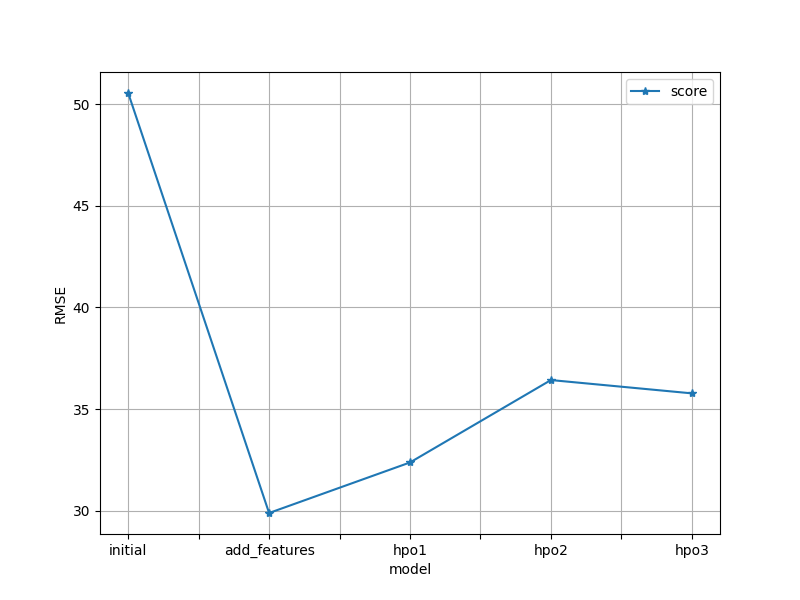
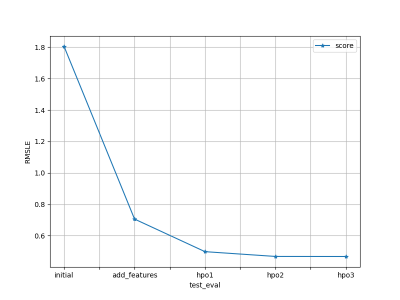

# Report: Predict Bike Sharing Demand with AutoGluon Solution
#### Noman Arshad

## Initial Training
### What did you realize when you tried to submit your predictions? What changes were needed to the output of the predictor to submit your results?
The output column (count - number of total rentals) should not be less than 0 as count can not be negative. So before submiting predictions we need to make sure that our predictions does not contain any negative value in predicted count.

### What was the top ranked model that performed?
WeightedEnsemble_L2 with feature engineering and Hyper parameter optimization.

## Exploratory data analysis and feature creation
### What did the exploratory analysis find and how did you add additional features?
I checked correlation matrix of train df and found that initialy most correlated column was temp and realized that temp is not constant for every hour in a day and also for every week might have different avg temp. So I created some additional columns based on datetime provided to fetch hour of day, week of year, weekday etc. and it really helped in improving model performance.

### How much better did your model preform after adding additional features and why do you think that is?
Model improved significantly after adding new features. I think it is due to the quality of feature. By adding creating highly correlated feature it helps model to learn better and find better decision boundary.

## Hyper parameter tuning
### How much better did your model preform after trying different hyper parameters?
Model performance improved with hyper parameter optimization but not that much as it improved by adding new features. From score table you can see by adding new features it improved significantly from 1.8 RMSLE to 0.7, and after HPO it improved by 0.2 RMSLE further.

### If you were given more time with this dataset, where do you think you would spend more time?
I would like to spend more time on feature engineering to create new useful features that help model to learn decision boundary for better accuracy. With this I would also like to play with hyperparameters.

### Create a table with the models you ran, the hyperparameters modified, and the kaggle score.
|model|hpo1|hpo2|scheduler|trial_time (seconds)|score|
|--|--|--|--|--|--|
|initial|default|default|default|600|1.80425|
|add_features|default|default|default|600|0.70588|
|hpo|auto|auto|ASHA|600|0.49844|
|hpo1|GBM: num_boost_round=80, num_leaves(lower=10, upper=50, default=20)|NN_TORCH: num_epochs=10, learning_rate(1e-3, 1e-2, default=5e-3, log=True),activation('relu', 'softrelu', 'tanh'),layers([100],[200, 100])|local|600|0.46803|
|hpo2|GBM: num_boost_round=80, num_leaves(lower=10, upper=50, default=20)|NN_TORCH: num_epochs(lower=8, upper=20, default=10), learning_rate(1e-3, 1e-2, default=5e-3, log=True),activation('relu', 'softrelu', 'tanh'),layers([100],[1000],[200, 100])|local|600|0.46803|

### Create a line plot showing the top model score for the three (or more) training runs during the project.

### Create a line plot showing the top kaggle score for the three (or more) prediction submissions during the project.

## Summary
=======
# Report: Predict Bike Sharing Demand with AutoGluon Solution
#### Noman Arshad

## Initial Training
### What did you realize when you tried to submit your predictions? What changes were needed to the output of the predictor to submit your results?
The output column (count - number of total rentals) should not be less than 0 as count can not be negative. So before submiting predictions we need to make sure that our predictions does not contain any negative value in predicted count.

### What was the top ranked model that performed?
WeightedEnsemble_L2 with feature engineering and Hyper parameter optimization.

## Exploratory data analysis and feature creation
### What did the exploratory analysis find and how did you add additional features?
I checked correlation matrix of train df and found that initialy most correlated column was temp and realized that temp is not constant for every hour in a day and also for every week might have different avg temp. So I created some additional columns based on datetime provided to fetch hour of day, week of year, weekday etc. and it really helped in improving model performance.

### How much better did your model preform after adding additional features and why do you think that is?
Model improved significantly after adding new features. I think it is due to the quality of feature. By adding creating highly correlated feature it helps model to learn better and find better decision boundary.

## Hyper parameter tuning
### How much better did your model preform after trying different hyper parameters?
Model performance improved with hyper parameter optimization but not that much as it improved by adding new features. From score table you can see by adding new features it improved significantly from 1.8 RMSLE to 0.7, and after HPO it improved by 0.2 RMSLE further.

### If you were given more time with this dataset, where do you think you would spend more time?
I would like to spend more time on feature engineering to create new useful features that help model to learn decision boundary for better accuracy. With this I would also like to play with hyperparameters.

### Create a table with the models you ran, the hyperparameters modified, and the kaggle score.
|model|hpo1|hpo2|scheduler|trial_time (seconds)|score|
|--|--|--|--|--|--|
|initial|default|default|default|600|1.80425|
|add_features|default|default|default|600|0.70588|
|hpo|auto|auto|ASHA|600|0.49844|
|hpo1|GBM: num_boost_round=80, num_leaves(lower=10, upper=50, default=20)|NN_TORCH: num_epochs=10, learning_rate(1e-3, 1e-2, default=5e-3, log=True),activation('relu', 'softrelu', 'tanh'),layers([100],[200, 100])|local|600|0.46803|
|hpo2|GBM: num_boost_round=80, num_leaves(lower=10, upper=50, default=20)|NN_TORCH: num_epochs(lower=8, upper=20, default=10), learning_rate(1e-3, 1e-2, default=5e-3, log=True),activation('relu', 'softrelu', 'tanh'),layers([100],[1000],[200, 100])|local|600|0.46803|

### Create a line plot showing the top model score for the three (or more) training runs during the project.

### Create a line plot showing the top kaggle score for the three (or more) prediction submissions during the project.

## Summary
We can improve model performance by spending time on EDA and feature engineering. With better features we can train better models. After training model on data we can then fine tune model by playing with its hyper parameters.